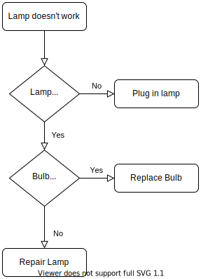

> ### `WARNING!!!` <br/>
> Due to github's HTTP security policy changes this script does not work any more.

# drawio
Utility to open draw.io diagrams directly from GitHub's Markdown

## Usage
```
[](https://kildom.github.io/drawio/#diagram.drawio)
```
where:
* `diagram.svg` is an image exported from draw.io
* `diagram.drawio` is a diagram

Remember to export image to `diagram.svg` after each change of `diagram.drawio`.

## Demo

[](https://kildom.github.io/drawio/#test.drawio)

(click to edit)
